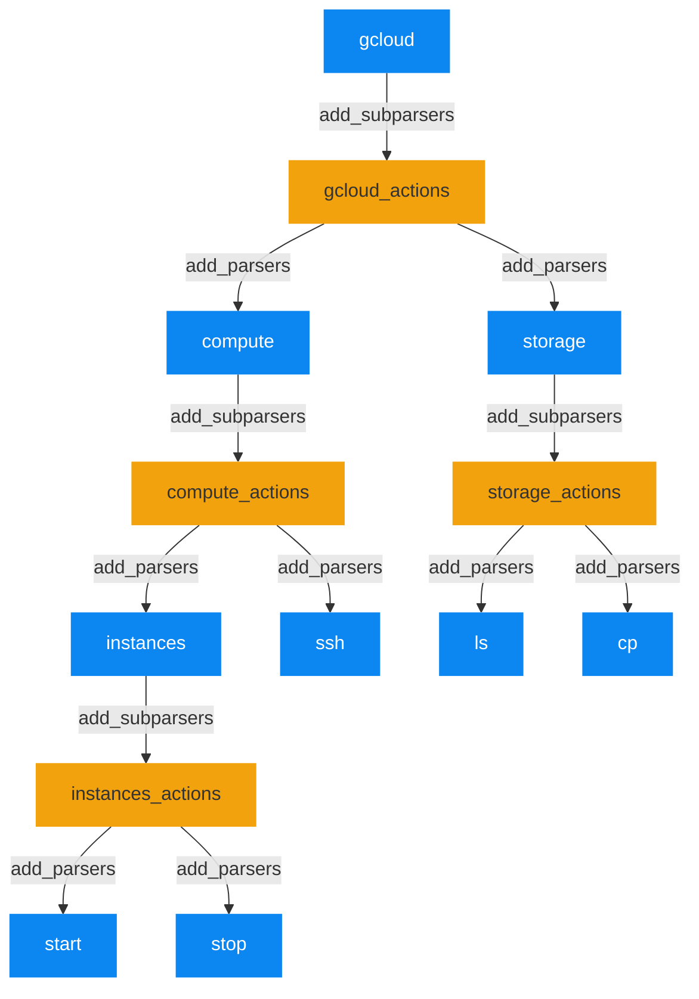

たまに使うんだけど毎日使うというほどでもないので使い方を何回も調べている道具シリーズ。

argparseでサブコマンドを使いたい、ということは何回かあった。
毎回、適当にググってコピペして何となく動いてるからいいや、で済ませてきたのだが、
今回、多階層にわたるサブコマンドを定義したくなり、ちゃんと分かっとかないとできなさそうだったので、
キチンと調べてメモしておこう。

## 単純な使い方

```python
import argparse

parser = argparse.ArgumentParser("hoge")

parser.add_argument("arg")
parser.add_argument("--opt")

args = parser.parse_args()
```

これを`hoge.py`として保存すると、以下のようなオプションと位置引数を取るスクリプトが作れる。

```shell
$ python hoge.py --help
usage: hoge.py [-h] [--opt OPT] arg

positional arguments:
  arg

options:
  -h, --help  show this help message and exit
  --opt OPT
```

つまり、`argparse.ArgumentParser`のインスタンスを作り、そいつに位置引数 or オプション引数を設定していく。

## サブコマンドを定義する

```python
import argparse

parser = argparse.ArgumentParser("hoge2.py")
parser.add_argument("--opt")
actions = parser.add_subparsers()

sub1 = actions.add_parser("sub1")
sub1.add_argument("--sub1-opt")
sub1.add_argument("sub1-arg")

sub2 = actions.add_parser("sub2")
sub2.add_argument("--sub2-opt")
sub2.add_argument("sub2-arg")

args = parser.parse_args()
```

これをhoge2.pyとして保存すると、以下のようにサブコマンドを持ったスクリプトを作れる。

```shell
$ python hoge2.py --help
usage: hoge2.py [-h] [--opt OPT] {sub1,sub2} ...

positional arguments:
  {sub1,sub2}

options:
  -h, --help   show this help message and exit
  --opt OPT
```

```shell
$ python hoge2.py sub1 --help
usage: hoge2.py sub1 [-h] [--sub1-opt SUB1_OPT] sub1-arg

positional arguments:
  sub1-arg

options:
  -h, --help           show this help message and exit
  --sub1-opt SUB1_OPT
```

```shell
python hoge2.py sub2 --help
python hoge2.py sub2 --help
usage: hoge2.py sub2 [-h] [--sub2-opt SUB2_OPT] sub2-arg

positional arguments:
  sub2-arg

options:
  -h, --help           show this help message and exit
  --sub2-opt SUB2_OPT
```

サブコマンドを登録するには、2つのステップを踏む。

1. `Parser.add_subparsers`によって、`_SubParsersAction`オブジェクトを得る
2. `_SubParsersAction.add_parser`によって、`ArgumentParser`オブジェクトを得る

2.で得られた`ArgumentParser`オブジェクトに、必要な位置引数・オプションを設定することができる。

## 多段階のサブコマンドを作る

上のことを繰り返せば、多段階のサブコマンドを定義できる。例として、以下のような階層を持ったサブコマンドを定義してみる。



- <span style="background: #0C87F2; color:white">青い四角</span>が`ArgumentParser`オブジェクト
- <span style="background: #F2A20C">黄色い四角</span>が`_SubParsersAction`オブジェクト

```python
import argparse

gcloud = argparse.ArgumentParser("gcloud")
gcloud_actions = gcloud.add_subparsers()

compute = gcloud_actions.add_parser("compute")
compute_actions = compute.add_subparsers()

instances = compute_actions.add_parser("instances")
instances_actions = instances.add_subparsers()

start = instances_actions.add_parser("start")
stop = instances_actions.add_parser("stop")

storage = gcloud_actions.add_parser("storage")
storage_actions = storage.add_subparsers()

ls = storage_actions.add_parser("ls")
cp = storage_actions.add_parser("cp")

gcloud.add_argument("--project")
gcloud.add_argument("--region")

start.add_argument("instance")
stop.add_argument("instance")

ls.add_argument("name")
cp.add_argument("source")
cp.add_argument("destination")
cp.add_argument("--recursive", "-r")

args = gcloud.parse_args()
```

実行例

```shell
$ python gcloud.py compute instances start --help
usage: gcloud compute instances start [-h] instance

positional arguments:
  instance

options:
  -h, --help  show this help message and exit

```
